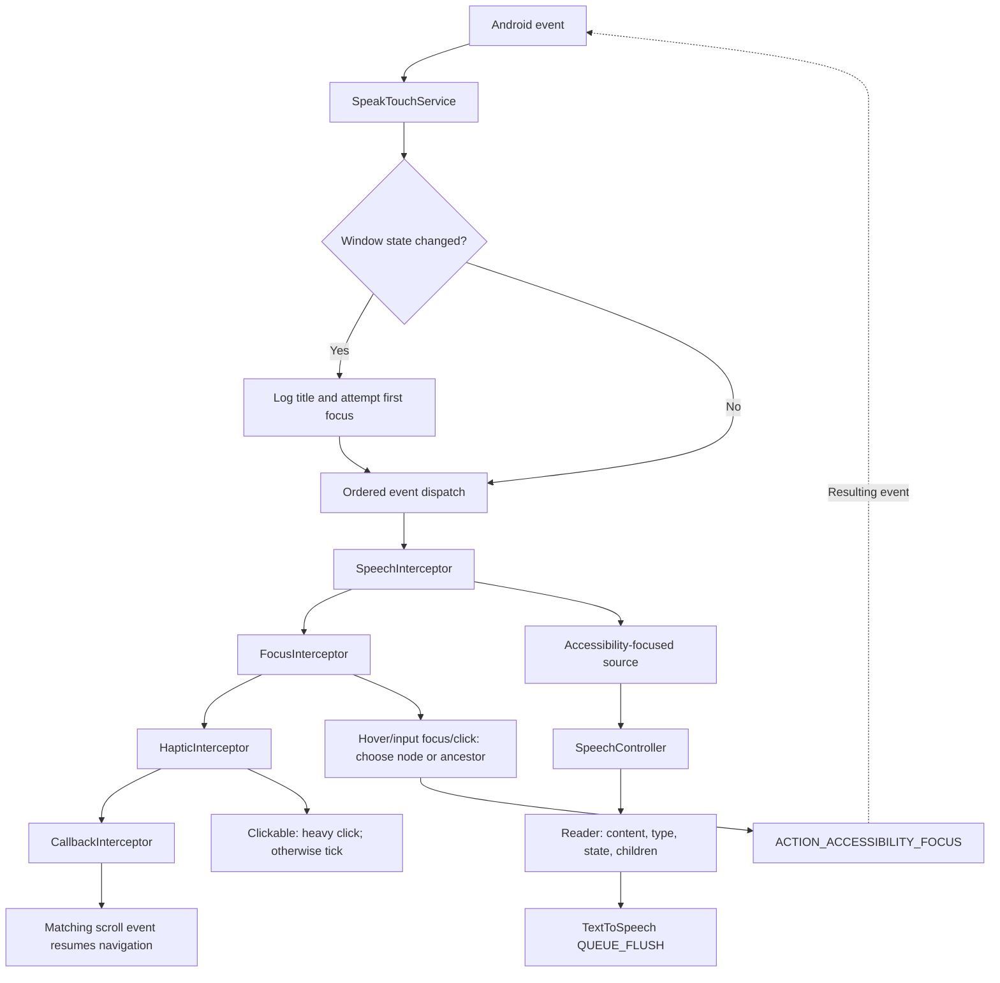

# Architecture flow

Static assessment, 2026-10-06, baseline f8bc445. See [overview](CODE_OVERVIEW.md) and [capabilities](CURRENT_CAPABILITIES.md).

## Startup/shutdown

1. SpeakTouchApplication initializes debug Timber; Hilt supplies the service graph.
2. Service onCreate installs weak service reference in Controllers.
3. ControllerModule constructs TTS/accessibility audio attributes. SUCCESS callback accesses Controllers.speech and speaks activation using QUEUE_FLUSH.
4. Service connection adds API 31+ two-finger passthrough; XML provides other flags.
5. Destruction finishes event interceptors: TTS shutdown and vibration cancel; Controllers uninstalls. Focus/callback use default no-op finish. onInterrupt does nothing.

## Event to speech

Speech runs before focus. Hover does not directly speak: focus is requested, then resulting accessibility-focus event is spoken. Touch-interaction start stops active speech. Window titles are logged rather than directly spoken. Other subscribed events can pass through unhandled.

## Gesture to focus

1. Legacy onGesture(Int) delegates to GestureInterceptor.
2. Left/right calls previous/next; FocusController queries active root accessibility focus, falls back to root.
3. NodeScan walks tree order; NodeFilter/NodeValidator select readable targets and avoid independently reading grouped children.
4. Candidate receives accessibility focus; scan ends even if action returns false.
5. If no candidate selected within ancestor, attempt scroll. Success stores continuation; matching TYPE_VIEW_SCROLLED invokes latest matching callback and resumes default navigation.
6. Resulting accessibility-focus event supplies speech and haptic feedback.

Down-then-left requests global Back; API 31+ two-finger double tap requests headset-hook. Both return handled without checking action success.

## Limits

One scan handles one navigation request. Child recursion builds one grouped description; neither is continuous reading. Scroll continuation has no timeout. No utterance-completion listener, editing cursor/granularity state, web layer, preference repository or settings activity exists.

Window-change moveFocusToFirst uses argument-free next-at-granularity if already focused. It is not established first-node or text navigation. Root availability, action failures, TTS readiness and event delivery lack general recovery. These are source findings, not device failures reproduced here.
